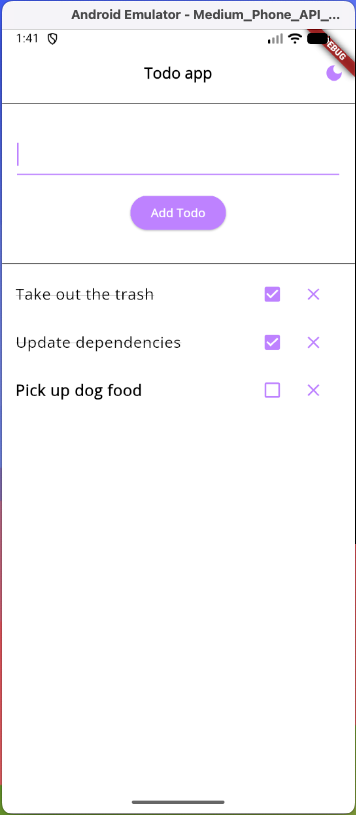

# flutter_starter_todo_app

A simple Todo App built with Flutter using Clean Architecture, BLoC for state management, go_router for navigation and Isar for local storage.



<br />

## Getting Started

To get started, make sure you have flutter and dart installed, then clone this repo and `cd` into it and run the following:

```bash
flutter pub get
```

Then, to generate build_runner files, run the following command:

```bash
rps generate files
```

Then run on the desired simulator.

<br />

### Generating App Icons

To generate the proper App Icons, you can run the [flutter_launcher_icons](https://pub.dev/packages/flutter_launcher_icons), first check the `pubspec.yaml` file to ensure that the expected target is identified, (pointing to the correct image in assets/images). Then you can run the following command to generate new icons.

```bash
rps generate icons
```

<br />

### Project Architecture

The project architecture is based on Clean Architecture which promotes the separation of concerns and the creation of highly maintainable and flexible software systems. This is accomplished by organizing the codebase into independent layers that communicate through defined interfaces.


<br />

#### The Folder Structure

The folder structure consists of a multiple layers, at the root level, we have the `config` folder, used to store specific applicaiton configuration data like `router`, `constants`, and `theme`. After the `config` folder, we have the `core` folder used to share code across different features in our app. These would hold things like app wide `usecases`, `utils`, `error`, and more. Then we have the `features` folder, where each feature of our app is broken down into separate layers. For example, in the `features` folder we have the `todo` feature, this includes everthing we need to add a Todo List feature to our application.


<br />

##### The Data Layer

The `data` layer is one of the layers in the architecture, responsible for managing the storage and retrieval of data used by the application. It interacts with the infrastructure of the application, such as the database, external APIs, or any other data source. It is also responsible for implementing the business logic related to data storage and retrieval. This includes implementing data access methods, handling data validation and mapping, and managing the data source connection and transactions.

<br />

##### The Presentation Layer

In Clean Architecture, the `presentation` layer is the layer responsible for handling the user interface and user interaction with the application. It is the layer closest to the user and is responsible for presenting data and receiving input.

The Presentation Layer typically consists of user interface components, such as screens, forms, and widgets, and controllers or presenters that handle user input and interaction. It communicates with the Domain Layer through a set of interfaces or protocols that define the operations that can be performed by the user interface.

##### The Domain Layer

The `domain` layer is the most important layer of the architecture, as it contains the core business logic of the application. It is responsible for representing the concepts and entities of the business domain, and it defines the rules and behavior of the application. The separation of concerns helps to ensure that the application’s business logic remains independent of the user interface, the data storage mechanism, and other external systems.

In Clean Architecture, the Domain Layer should be independent of any specific implementation or framework. This means that the code in the Domain Layer should be written in a technology-agnostic way, with no dependencies on external systems or libraries.

<br />

#### State Management: BLoC

[BLoC](https://pub.dev/packages/flutter_bloc) stands for (Business Logic Components), is a design pattern that is used to manage the state of an application. It separates the business logic from the UI, making it easier to manage and maintain the application’s codebase. The main purpose of BLoC is to provide a clean, reactive and scalable architecture that can handle complex user interfaces and state management.

BLoC pattern is implemented using streams in Dart, which allows for a reactive programming style. In this pattern, the business logic is handled by a bloc, which is a component that receives events from the UI, processes them, and emits new states. The UI, on the other hand, listens to these state changes and updates the UI accordingly.

<br />

#### Navigation

The app uses [go_router](https://pub.dev/packages/go_router) to handle app navigation and implements a declarative route structure that can be found in the `config/router.dart` file. Here you will see that we define a list of routes and map each route to a desired screen file.

<br />

### Testing

todo
